KD-Tree Module Technical Imagesation

 Overview

This module implements a KD-Tree data structure based on 3D space, supporting efficient spatial query operations, including nearest neighbor search, range search, and frustum culling. It is suitable for point cloud data management, proximity queries, and other scenarios.

\------

Download the example project：https://github.com/kak0na/Unreal_GRKDTree/tree/main

Open Map: Map_KDTreeDemo，Modify different queryType values to see different effects

 Usage Example

1. Create an Actor based on GRKDTreeStruct

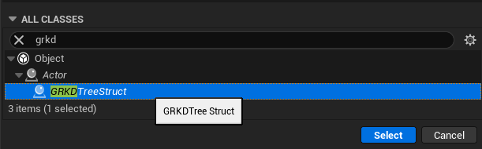 

2. Place the Actor in the scene

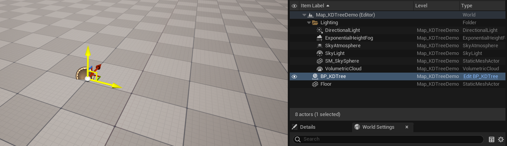

3. Create a Locations array

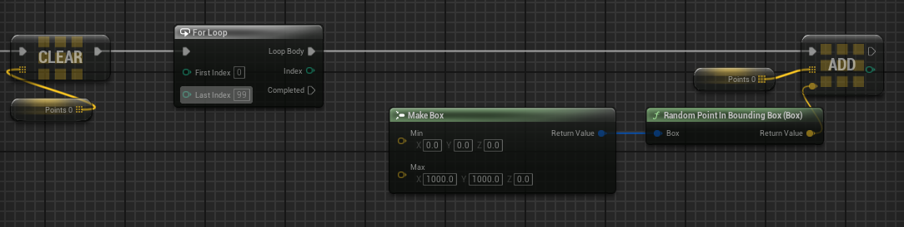 

4. Construct the data structure

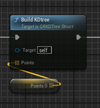 

5. Set queryType and perform queries

queryType: 0: Query the nearest point

queryType: 1: Query the nearest N points

queryType: 2: Query points within a spherical range

queryType: 3: Query the nearest N points within the field of view

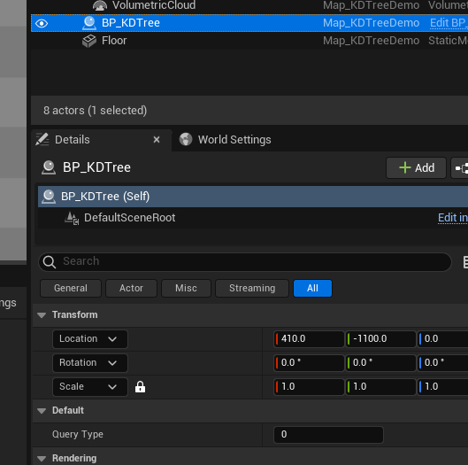 

Query the nearest point

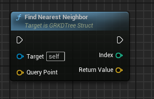 

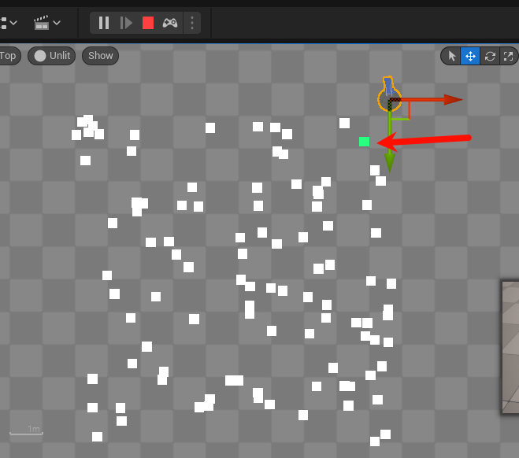 

 

Query the nearest 10 points

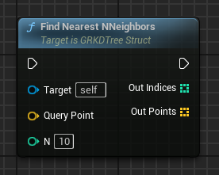 

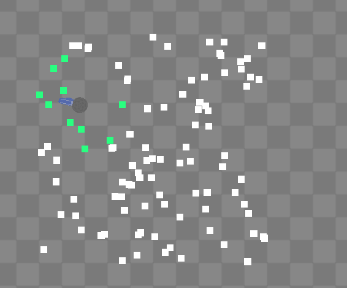 

 

Query points within a spherical range

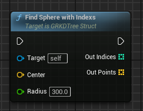 

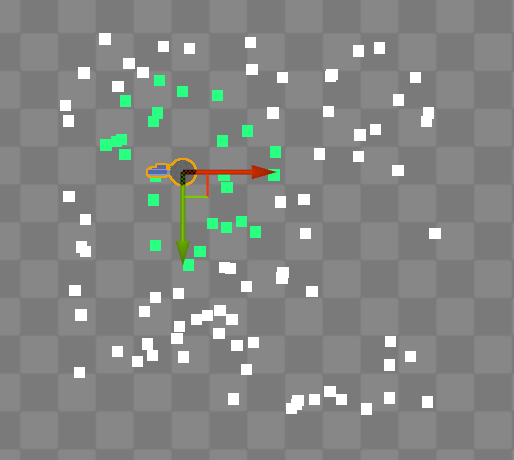 

Query the nearest 10 points within the field of view

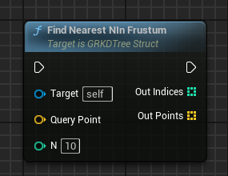 

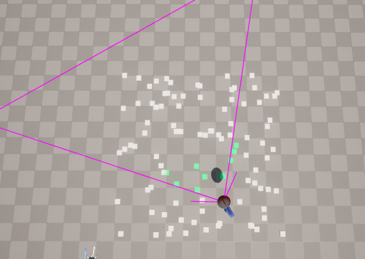 

All Blueprint Content

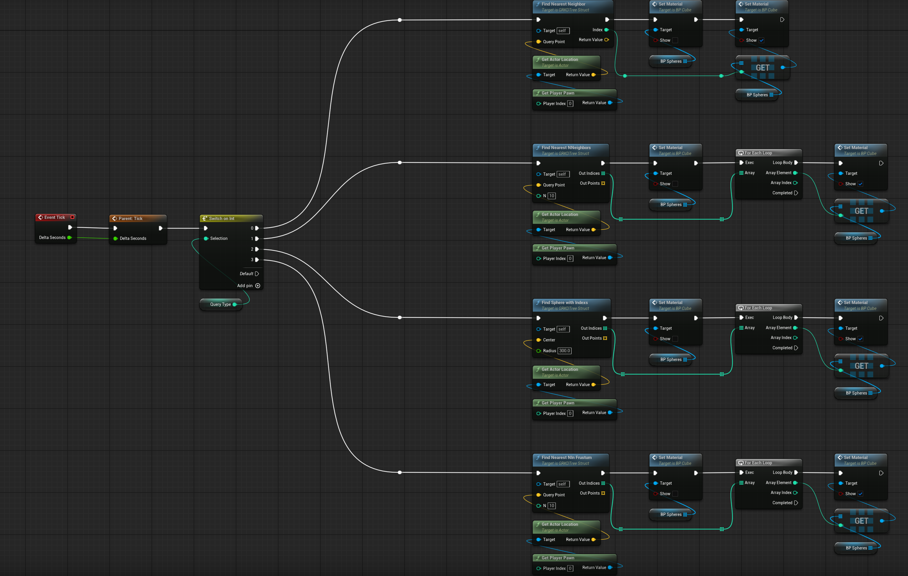

------

 Performance Optimization

The performance is exceptionally superior.

| Number of Points | Construction Time |
| ---------------- | ----------------- |
| 1,000 points     | 0.0001s          |
| 10,000 points    | 0.002s           |
| 400,000 points   | 0.17s            |

**Recommendations**:

1. Regularly rebuild the tree structure for frequently updated scenes.